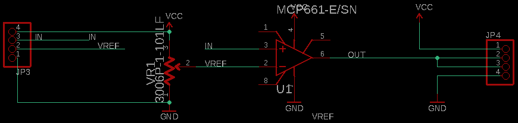
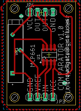
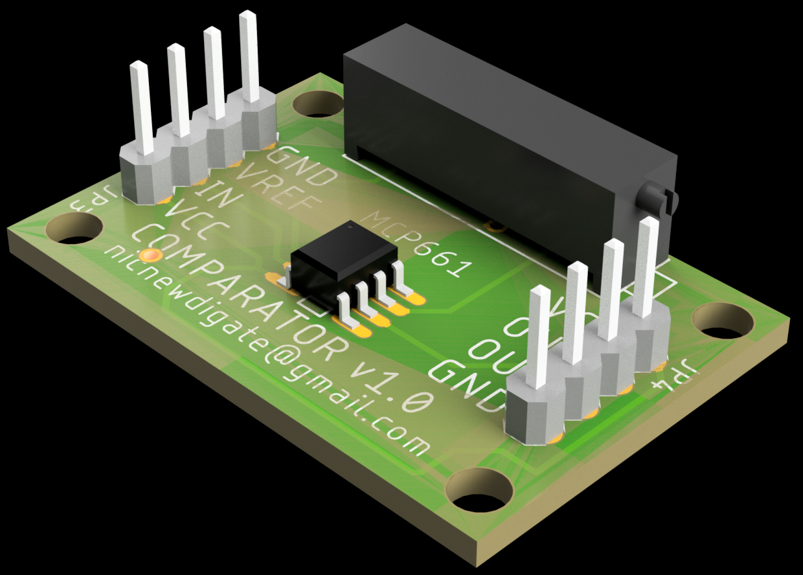

# electronics-comparator
comparator circuit using MCP661

I have a 900 mV digital signal and I need it to be 3.3V. 

The output of AL1401 audio-to-fibreoptic is 900mV and the PLT133 Adat fibre-optic transmitter led needs 3.3V. So I thought I'd try to use an opamp as a comparator. 

